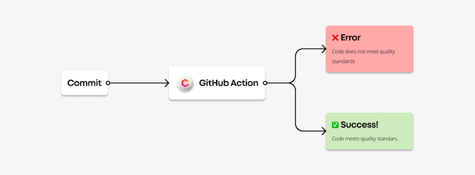

[Datadog acquired Codiga](https://www.codiga.io/blog/codiga-joins-datadog/). This repository is no longer active.

# Use Codiga GitHub Action

This repository is an example of use of the [Codiga GitHub Action](https://github.com/marketplace/actions/codiga-github-action).

You can check the file [.github/workflows/main.yml](.github/workflows/main.yml) in this directory to check how to use the Codiga GitHub Action.

## About Codiga

 * Automate your code reviews using the [Codiga GitHub App](https://github.com/marketplace/code-inspector)
 * Ensure that all merge requests satisfy your code quality standards using the [Codiga GitHub Action](https://github.com/marketplace/actions/codiga-github-action)
 * Use our [Coding Assistant](https://doc.codiga.io/docs/coding-assistant/coding-assistant-getting-started/) to write code faster in [VS Code](https://marketplace.visualstudio.com/items?itemName=codiga.vscode-plugin) or [JetBrains](https://plugins.jetbrains.com/plugin/17969-codiga) products
 * Learn more about Codiga at https://www.codiga.io

